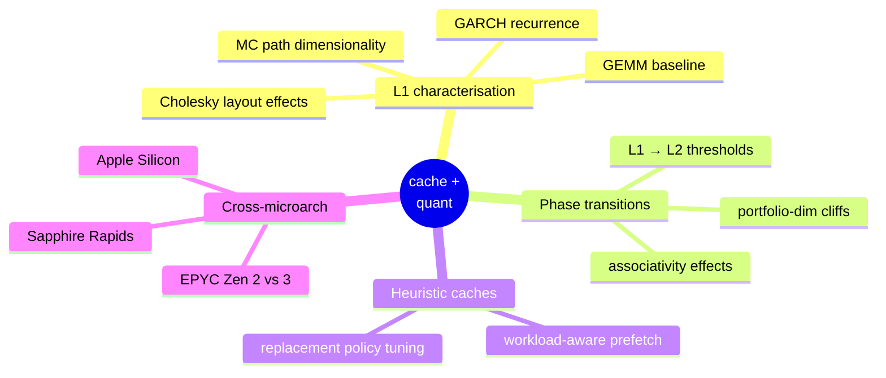
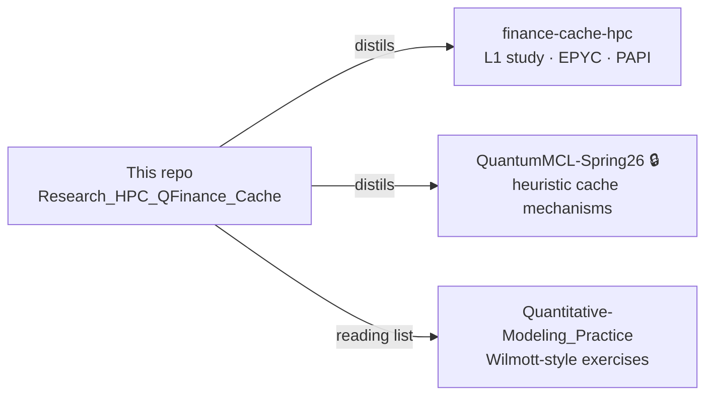

<div align="center">

# Research_HPC_QFinance_Cache

**Research thread on cache behaviour in quantitative finance workflows — working notes, experiments, and feeder pipelines for the published studies.**

<br/>


</div>

---

## What this is

The working notebook behind my research on **cache-aware numerical methods for quantitative finance**. This is the messy upstream — experiments, rough benchmarks, architecture notes, reading lists — that feeds the polished downstream publications.

If you want the clean, published version of one line of this research, see [**finance-cache-hpc**](https://github.com/pbathuri/finance-cache-hpc) — the L1 cache characterisation study of Cholesky, Monte Carlo, GARCH and GEMM on AMD EPYC.

---

## Research questions I'm chasing



---

## How it connects



---

## Related public work

- [**finance-cache-hpc**](https://github.com/pbathuri/finance-cache-hpc) — published empirical L1 study
- [**Quantitative-Modeling_Practice**](https://github.com/pbathuri/Quantitative-Modeling_Practice) — modelling exercises that feed the kernel selection

## Related private work

- **QuantumMCL-Spring26** — heuristic cache mechanisms for finance workflows (available on request)

---

## Citing the downstream paper

```bibtex
@misc{bathuri2026cache,
  author       = {Pradyot Bathuri},
  title        = {Cache-Aware Computation for Quantitative Finance Workloads on {AMD} {EPYC}},
  year         = {2026},
  institution  = {Indiana University Bloomington},
  howpublished = {\url{https://github.com/pbathuri/finance-cache-hpc}}
}
```

---

<div align="center">
<sub>Graduate research at <b>Indiana University · Luddy School</b> · <a href="https://github.com/pbathuri">@pbathuri</a></sub>
</div>
